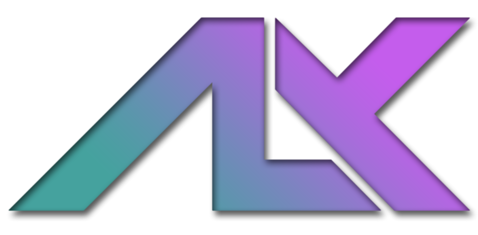

# Image Generation Toolbox

A robust, high-performance local asset manager designed specifically for the AI image generation ecosystem. It unifies metadata parsing across fragmented formats, providing **SQL-backed FTS search**, **collections**, **live folder monitoring**, and **deep node inspection** in a modern, dark-themed interface.

---

## 📸 Interface

### Core Workflow
| Library Browser | Speed Sorter ⚡ |
|:---:|:---:|
|  |  |
| *Grid Gallery with Live Monitoring* | *Rapid Organization with Keyboard Shortcuts* |

### Metadata & Inspection
| Metadata Sidebar | Deep Inspection |
|:---:|:---:|
|  |  |
| *Unified Parameter Display & Ratings* | *High-Res Zoom & Pan* |

<b>View Advanced Features</b>

 

| Raw Data View | Search & Filtering |
|:---:|:---:|
|  |  |
| *Underlying JSON/Parameter Blocks* | *FTS5-Powered Instant Search* |

---

## 🔐 Portable, Private & Secure

Designed for the privacy-conscious artist, this application operates on a strictly "Local-First" philosophy.

* **Zero-Installation Portability:** The application runs entirely from its own directory. All databases (`library.db`), thumbnails, and settings are stored in a relative `./data` folder.
  * *Travel Ready:* Move the entire folder to a USB stick or external drive, and your library, collections, and ratings travel with you.
* **100% Offline / No Telemetry:** There are no "cloud sync" features, analytics, or background API calls. Your prompts and generation data never leave your machine.
* **Privacy Scrubbing:** The integrated **Scrubber View** allows you to sanitize images before sharing them on social media. It strips hidden generation metadata (Prompts, ComfyUI Workflows, Seed data) while preserving the visual image quality.

---

## ✨ Key Features

* **Universal Metadata Engine:** Advanced parsing strategies for the entire stable diffusion ecosystem.
  * **ComfyUI:** Traverses complex node graphs (recursive inputs) and API formats to identify the true Sampler, Scheduler, and LoRAs used.
  * **Automatic1111 / Forge:** Robust parsing of standard "Steps: XX, Sampler: XX" text blocks.
  * **Others:** Native support for **InvokeAI**, **SwarmUI**, and **NovelAI**.
* **Library Management:**
  * **Collections & Albums:** Create virtual collections to organize images across different folders without moving files.
  * **Pinned Folders:** Bookmark frequently accessed directories for quick navigation.
  * **Star Ratings:** Rate images (1-5 stars) and filter/sort by rating.
  * **Tagging System:** Add/Remove custom tags to any image for precise categorization.
* **Speed Sorting:** A dedicated mode for processing high-volume generation batches.
  * **Hotkeys:** Instantly move images to configurable target folders or collections.
  * **Recycle Bin:** Safely move unwanted results to the OS trash.
* **Performance:**
  * **Live Monitoring:** Uses Java's `WatchService` to automatically detect and index file additions or deletions in real-time.
  * **Virtualization:** Uses `GridView` and `SoftReference` caching to handle folders with thousands of images without memory leaks.
  * **Background Indexing:** Dedicated non-blocking threads process metadata extraction to keep the UI buttery smooth.
* **Modern UX:**
  * **Dark Theme:** "Deep Neon Cinematic" CSS styling for a professional look.
  * **Touch-Friendly:** Custom title bars and resize helpers for a frameless window experience.

---

## 🛠️ Technical Architecture

The application is built on a strict **MVVM (Model-View-ViewModel)** architecture using the `mvvmfx` framework and `Google Guice` for dependency injection.

* **Persistence Layer:**
  * **SQLite & FTS5:** Uses SQLite's Full-Text Search 5 extension to enable instantaneous text queries over prompts, models, and metadata.
  * **HikariCP:** Enterprise-grade connection pooling ensures high-performance database access.
  * **WAL Mode:** Write-Ahead Logging is enabled for improved concurrency.
* **Dependency Injection:** Clean separation of concerns with `AppModule` providing singletons for Repository, Metadata, and Indexing services.
* **Reactivity:** Heavily utilizes JavaFX `Properties` and `Observables` to bind UI state directly to the underlying data models.
* **Strategy Pattern:** Metadata parsing is delegated to specific strategy classes (`ComfyUIStrategy`, `SwarmUIStrategy`, etc.) chosen at runtime based on file content.

---

## 🚀 Getting Started

1. Extract the ZIP file.
2. Run the `ImageToolbox.jar` (or executable wrapper).
3. Drag and drop a folder to begin indexing.

---

## 📜 License

Distributed under the **MIT License**. Free for personal and commercial use.

---

## 💖 Support the Project

If the **Image Generation Toolbox** has streamlined your workflow, consider supporting its ongoing development. Your contributions help maintain compatibility with new AI platforms and node structures.

---

  <b>Developed by</b> 
   
  Copyright (c) 2026 Alexander Nilsson

